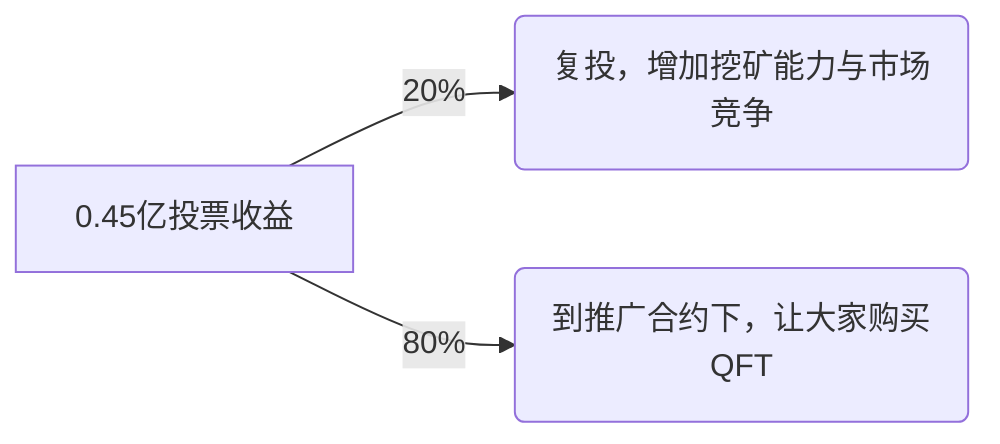
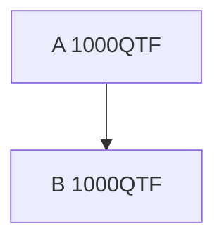
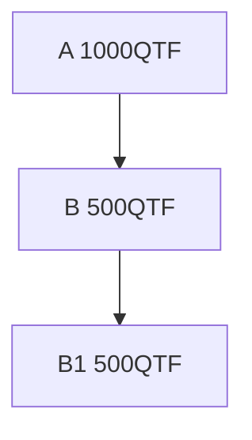

## 量化基金项目(Quantitative Fund Token) QFT

#### 项目背景
- 目前市场上的项目多为庞氏骗局，存活周期多为3个月到6个月之间，项目结束的那一刻哀鸿遍野一地鸡毛，项目方跑路走人，投资者血本无归。依靠高收益为噱头吸引投资者，不顾投资人资金安全，最后害人害己。 在区块链蓬勃发展的大背景下，好多投资者因为缺少专业h知识，盲目跟风错过了赚钱的机会，在此背景下成立了区块链量化基金项目(QFT)，有专业人士对区块链进行投资来回报普通投资者。
- QFT项目底层逻辑就与庞氏骗局有本质性的不同，可以永远运行下去，QFT项目不为投资者承诺高收益率，因为投资是个复杂的过程，不可能精确预测自己的收益率，只需知道大方向是正确的，用时间和价格来回报所有投资者。

#### 运行机制
- QFT项目为了增加社区人员的参与度增加了挖矿和推广机制。
- 推荐机制使用非线性算法，杜绝自己推广自己的现象(如果自己推广自己在大部分情况下挖矿能力不是最优)。
- 合约开源标准的去中心化项目，接受同行专家的审评。

###### 发行机制
- 发行10亿，初始金额0.5亿，挖矿金额9.5亿
- 初始0.5亿金额分配

项目   | 数量
:----:|:-----:
去中心化交易所 | 0.05亿
投票金额 | 0.45亿

- 挖矿金额9.5亿分配,每秒产出1个币，可挖10995.37天(约30.12年)
- 第一年的挖币年化率约70%
- 0.45亿投票的挖矿产出，把产出的币80%转到基金收益合约下用于大家推广QFT，20%产生用于复投，详细的流程图为:

- 推广合约规则
    - 第一年规则
        - 10%的U进入基金，用于量化投资
        - 80%的U到去中心化交易所购买，拉高价格
        - 10%的U进入社区领导，用于推广市场
    - 第一年以后的规则
        - 10%的U进入基金，用于量化投资
        - 90%的U到去中心化交易所购买，拉高价格。
        - 一年后弱化线下推广市场，靠品牌效应

###### 挖矿机制
- 推广好友，提升算力，增加挖矿收益
- A推广B的两种情况
> 正常推广

> 下级拆分

- 推广就是一棵不停向下蔓延的树,如果使用最简单的方法来做推广,不能保证推广者的收益.     
> - 示例1:
> 1. A推广了B，而B地址有1000个QFT.
> 2. A的推广值为1000,B的推广为0. 
> 3. B创建一个新账户B1，让B和B1建立推广关系，并把金额转到B1上.
> 4. A的推广值为0，B推广值1000，B1的推广值0，而A作为一个推广者，却没有任何收益.

- 如果把推广关系调整为上下级之间金额的最小值，且一个地址与上级也有关系，防止B把金额全部转走。  
> - 示例2：
> 1. 假设A推广了B，他们手中都有1000个QTF.  
> 2. A增加的推广值为1000，B的推广值也为1000.  
> 3. B创建一个新账户B1，并把1000个QFT转给B1，这样两个地址的收益都是0，B显然不会这样做，如果把500的QFT转给B1，
> 4. A增加的推广值为500  
    B的推广值为500+500=1000  
    B1的推广值为500  
    B账户的全部推广值为1000+500=1500，创建B1账户后，让上级的推广减少了500，而自己增加了500，这个规则虽然比示例1好很多，但是依然对推广者有利益损失。

- _针对上面的推广难题,提出了非线性算法，每个账户的基本算力等于投票金额的**1.125次方**，自己的推广算力与下级的权重为**1**, 与上级的权重为**2**，自身的权重为**4**。_   
> - **计算方法**  
> **基本算力:** $\Large pow(x) = x^{1.125} = x^{9/8} = x * \sqrt[8]{x}$      
> **实际算力:** $\Large f(x) = 6 * pow(x) + \min(pow(x),pow(x_{up})) + \sum(\min(pow(x),pow(x_{down})))$  
> - 示例3： 
> 1. A推广了B，A和B地址中分别有1000个QFT.
> 2. A增加的算力为: $1000^{1.125} \approx 2371.37$
> 3. B地址算力为:   $2371.37 + 2371.37 * 6 = 16599.59$
> 4. B创建一个新账户B1，并给B1转了500QFT.
> 5. A地址增加的算力为: $500^{1.125} \approx 1087.28$
> 6. B地址算力为:      $1087.28  + 1087.28 * 6 + 1087.28 = 8698.24$
> 7. B1地址算力为:     $1087.28 + 1087.28 * 6 = 7610.96$
> 8. B账户的总算力为:   $8698.24 + 7610.96 = 16309.2$
> 9. B的拆分后的算力小于拆分前，对推广者A构成了损失，对自己也构成了损失，因此A没有这样做的动力.

###### 投资回报策略
- 每季度利润的45%，到去中心化交易所购买QFT，购买到QFT打到挖矿合约下，用于提高下一年的挖矿收益率.
- 每季度利润的45%，用于滚雪球加大基金规模。
- 每季度利润的10%，用于给团队发工资。

###### 发展推广计划
- 提供开源github地址,接受同行的查阅验证.
- 提供官网,电报，推文,非小号查询
- 3个月创造百倍币的开门红
    - 交易所初始价格为0.002U(500万QFT对1万U)
    - 市场完成推广15万U，挖矿提现4万U，即完成百倍目标
- 6个月上Gate.io交易所
- 12个月上币安交易所